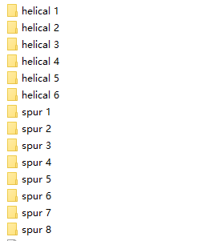
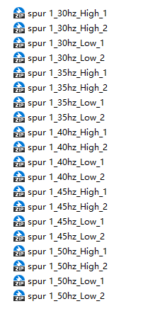
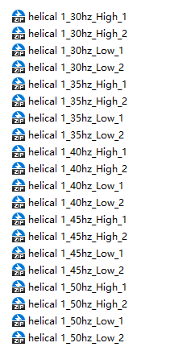
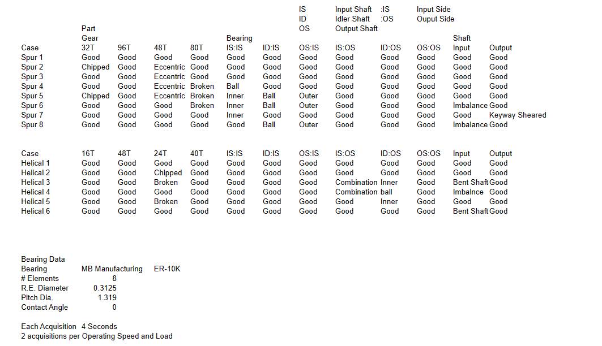
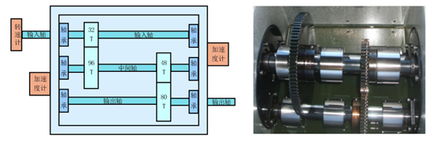
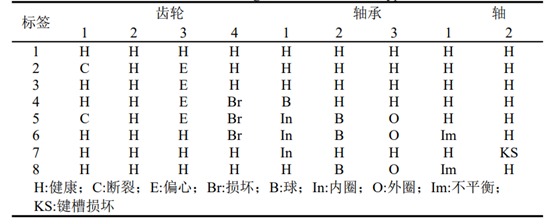
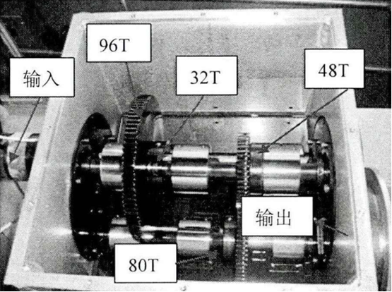
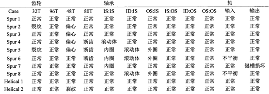
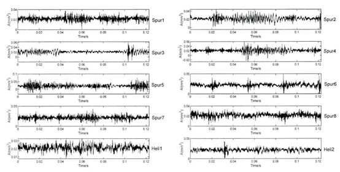

# PHM2009 Gearbox Fault Dataset

Introduction:
The PHM2009 gearbox dataset consists of data collected from the gearbox structure as shown in the figure below. Two accelerometers are fixed near the input and output shafts, respectively. The gearbox contains 8 types of complex faults, detailed as shown in the table below. Data is collected at 30, 35, 40, 45, and 50Hz shaft speeds under both high and low load conditions, with a sampling frequency of 66.7kHz.

Introduction:
This dataset was collected from the gearbox depicted in the figure below, which consists of three shafts, four straight gears, and six bearings. The dataset includes 16 types of fault data for different types of gears—straight and helical—occurring during gear failures at five different speeds. For example, the gearbox data at 1800rpm under ten states are presented in the table below.

In the table, IS represents the input shaft, ID stands for the intermediate shaft, OS denotes the output shaft, and Spur refers to gearbox fault data under different state conditions when installing straight gears. Helical represents helical gears, and their corresponding time domain plot is shown in the figure below. Each fault signal is comprised of 8192 data points.

## Images

Here is a pay link on Stripe ( https://buy.stripe.com/3cs8yP7sY87d0vu9AB ). Please contact me lonlonago@foxmail.com after funding $89, and I will send you a complete data files , thank you!

